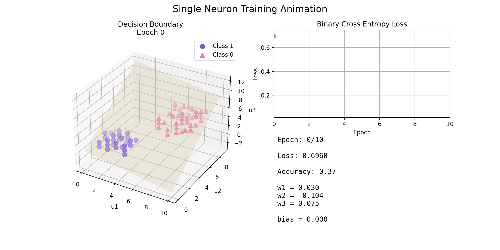
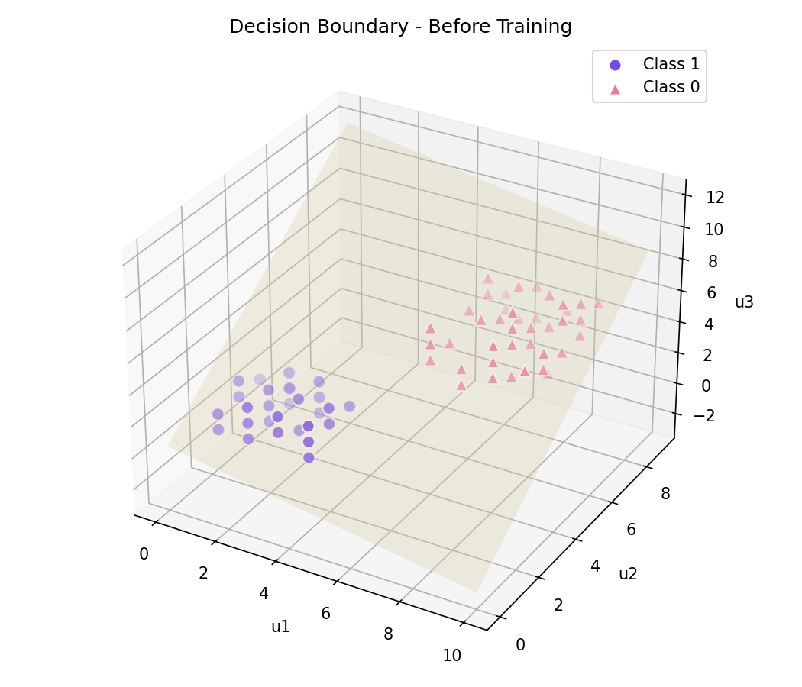
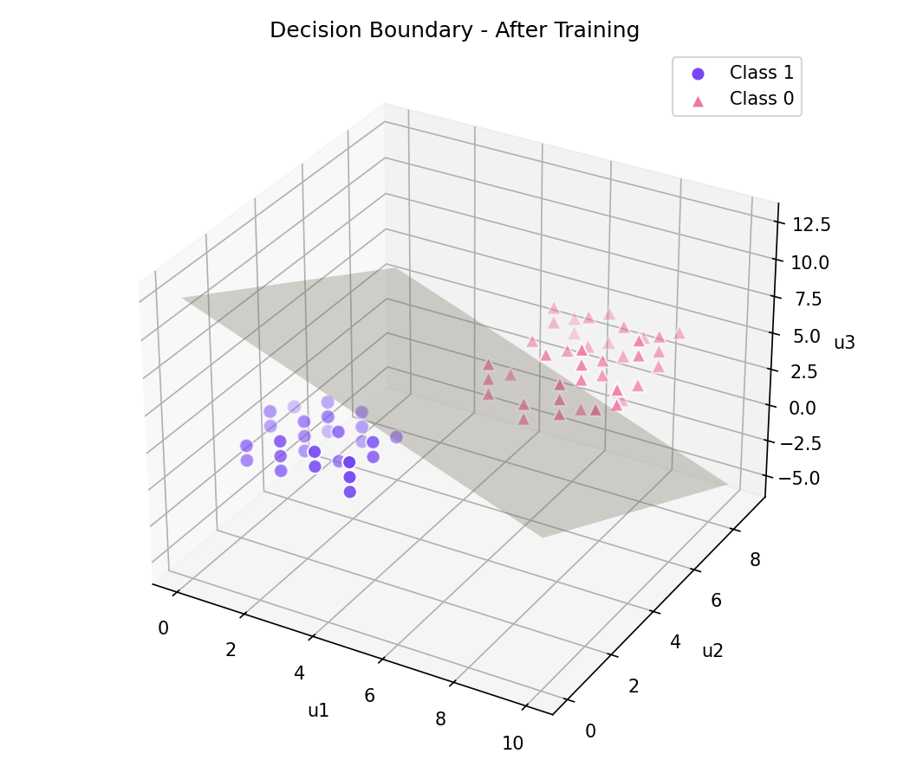
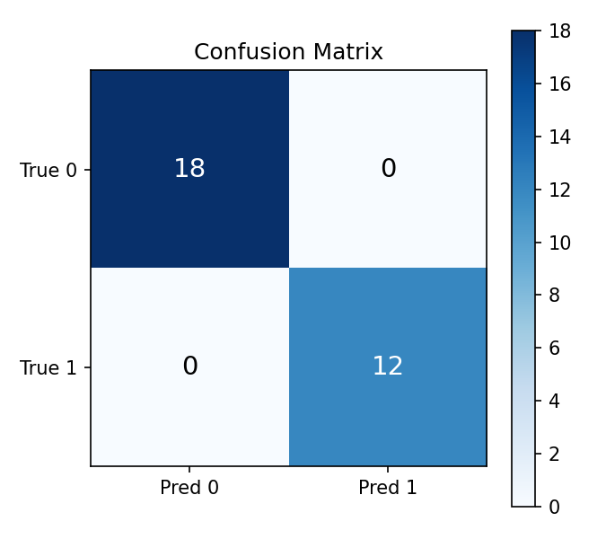

# Single Neuron Classifier — Logistic Regression From Scratch

A single artificial neuron (logistic regression classifier) implemented from scratch using **NumPy**. The neuron learns to separate two classes in a three-dimensional feature space with full-batch gradient descent, while an animated visualization shows how the decision boundary evolves throughout training.

This project was created as a learning exercise to understand how a single artificial neuron learns without relying on machine learning models from high-level libraries. Every stage of the training process—from forward propagation and gradient descent to decision boundary visualization—is implemented explicitly.

## Training animation



Each frame shows the state of the model for a single training epoch, including the current decision boundary in 3D, the binary cross-entropy loss curve, and the neuron's current weights, bias, loss, and test accuracy.

## Features

* Logistic regression implemented from scratch using NumPy
* Manual implementation of the sigmoid activation function
* Full-batch gradient descent optimization
* Binary cross-entropy loss
* Feature standardization before training
* 3D decision boundary visualization
* Animated training process exported as a GIF
* Confusion matrix and test set evaluation
* Step-by-step Jupyter notebook for exploring the training process

## Repository structure

| File                                                         | Description                                                                                          |
| ------------------------------------------------------------ | ---------------------------------------------------------------------------------------------------- |
| [neuron.ipynb](neuron.ipynb)                                 | Step-by-step notebook covering data loading, preprocessing, training, evaluation, and visualizations |
| [neuron_training_animation.py](neuron_training_animation.py) | Standalone script that trains the neuron and generates the animated GIF shown above                  |
| [neuron_dataset.csv](neuron_dataset.csv)                     | Toy dataset containing three numerical features (`u1`, `u2`, `u3`) and a binary `label`              |
| [figures/](figures/)                                         | Generated figures, including the decision boundary plots, confusion matrix, and training animation   |

## Model

The neuron computes

```text
z = w · x + b
ŷ = sigmoid(z)
```

where **w** represents the learned weights, **b** is the bias term, and the sigmoid function converts the linear output into a probability between 0 and 1.

The model is trained using full-batch gradient descent with binary cross-entropy loss. Features are standardized (zero mean and unit variance) before training to improve convergence. The learned parameters are then converted back into the original feature space so the decision boundary can be visualized using the raw feature values.

## Results

Training configuration:

* **Training epochs:** 10
* **Learning rate:** 1.0
* **Train/test split:** 70% / 30%
* **Test accuracy:** 100%

Final parameters:

* **Weights:** `w ≈ [-1.25, -1.19, -1.09]`
* **Bias:** `b ≈ -0.43`

| Before training                                                             | After training                                                           |
| --------------------------------------------------------------------------- | ------------------------------------------------------------------------ |
|  |  |



## Technologies

* Python
* NumPy
* pandas
* matplotlib
* scikit-learn
* Pillow

## Running the project

Install the required dependencies:

```bash
pip install numpy pandas matplotlib scikit-learn pillow
```

Generate the animated training visualization:

```bash
python3 neuron_training_animation.py
```

Or explore the project interactively in Jupyter Notebook:

```bash
jupyter notebook neuron.ipynb
```
